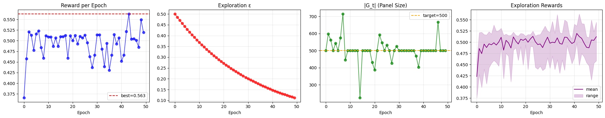

## Training Overview

**SelectSmart** is a reinforcement-learning framework for **gene panel selection** in single-cell transcriptomics.  
This project was developed as part of coursework with **Prof. Mykel Kochenderfer**  
([AA228 / CS238 – Decision Making under Uncertainty](https://mykel.kochenderfer.com/)) and extended through research assistantship work with **Prof. Xiaojie Qiu**  
([Qiu Lab, Stanford](https://www.devo-evo.com/people/xiaojie/)).

The method combines **meta-voted candidate genes**, an **actor–critic architecture**, and a reward balancing **clustering fidelity (ARI)** with **panel-size regularization**.

Trained on a **30k-cell kidney dataset** and evaluated on an **independent CZ Kidney dataset**, SelectSmart produces a **500-gene panel** that preserves transcriptomic geometry and **outperforms classical gene panel selection methods**.

**Status:** 🧪 Active development

### Report
📄 [Download the technical report (PDF)](report.pdf)

