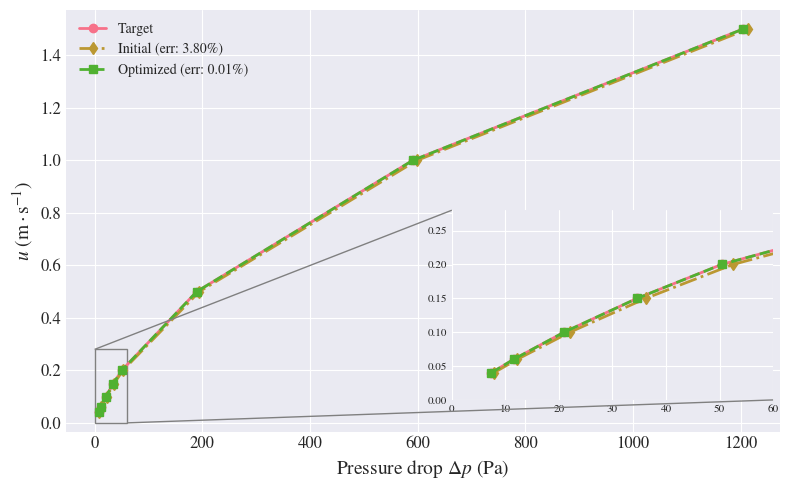

## Parachute Inflation
<iframe
  width="100%"
  height="420"
  src="https://www.youtube.com/embed/oUiSoeTgRko"
  frameborder="0"
  allowfullscreen>
</iframe>

This project presents a **physics-informed surrogate modeling framework** based on **Random Forests** for optimizing **fabric permeability** in **supersonic Mars landing parachutes**, conducted as part of a research project under ([**Prof. Jason Rabinovitch**](https://www.stevens.edu/profile/jrabinov#experience)) at Stevens Institute of Technology.

The method combines a **Darcy–Forchheimer analytical trend model** with a **Random Forest residual learner**, enabling accurate prediction of permeability coefficients across a high-dimensional geometric design space. The surrogate is embedded in a **multi-objective optimization pipeline** to identify pore geometries consistent with experimental permeability measurements.

The framework integrates:
- **Pore-scale CFD simulations** (NGA2)
- **Physics-informed Random Forest surrogate modeling**
- **Global multi-objective optimization** (NSGA-II, CTAEA)
- **Local high-fidelity refinement**

### Optimization results

Trained on **tens of thousands of CFD simulations**, the surrogate achieves **<10% worst-case relative error**, while optimized geometries reproduce experimental permeability with **<1% mean error**. The resulting models provide **efficient and physically consistent closures** for large-scale **FSI simulations of parachute inflation**.

**Status:** 📝 Paper in preparation

