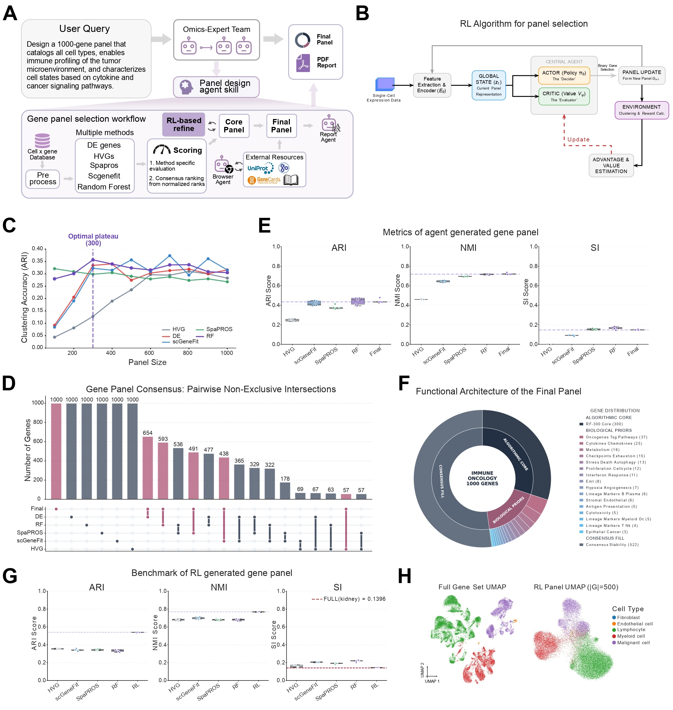

### System overview

This project focuses on the development of **Pantheon**, an open-source **multi-agent LLM platform for biological scientific workflows**  
([Pantheon Project](https://www.pantheon-os.com/)).

My work specifically targets **Gene Panel Selection (GPS)**, a core capability of Pantheon that automates the design of gene panels for **spatial transcriptomics** experiments.

The GPS system coordinates **five specialized LLM agents**, built on open-source models and extended with **custom toolchains and domain-specific reasoning**. A **Leader Agent** interprets ambiguous biological intent, decomposes high-level scientific questions into structured computational steps, and orchestrates agents such as the **Selection Expert**, with iterative validation and error handling.

This research is conducted in collaboration with **Prof. Xiaojie Qiu**  
([Qiu Lab, Stanford](https://www.devo-evo.com/people/xiaojie/))  
and **Dr. Weize Xu**  
([Stanford Profile](https://profiles.stanford.edu/weize-xu)).

Deployed in collaboration with **Vizgen**, Pantheon processes **large-scale multi-omics datasets** and produces **curated gene panels** that previously required extensive manual expertise.

**Status:** 📝 Paper in preparation
