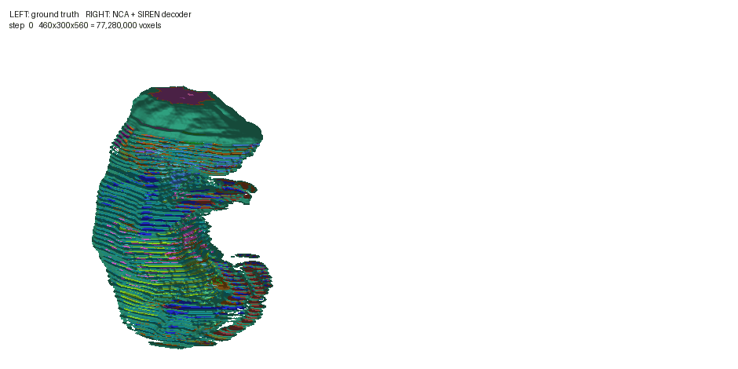

## Embryo Growth Simulation

This project trains **foundational 3D convolutional models** to reproduce **embryogenesis in silico**, capturing both **cell-level gene expression prediction** and **3D morphogenetic dynamics**. The goal is to learn a generative model of embryonic development that jointly predicts how cells divide, differentiate, and spatially organize — bridging gene regulatory networks with tissue-scale morphology.

The approach leverages volumetric deep learning architectures to model the spatiotemporal evolution of developing embryos, learning from multi-modal developmental biology datasets that combine single-cell transcriptomics with 3D imaging.

I am one of the participants of the **Virtual Embryo Challenge** — a community benchmark for computational models of embryonic development.

**[Virtual Embryo Challenge](https://virtualembryo.ai/challenge)** — check it out and don't hesitate to participate!

**Status:** More to come soon!
